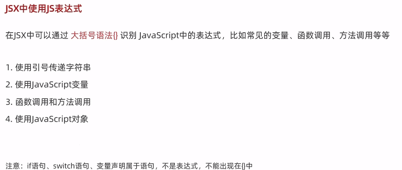
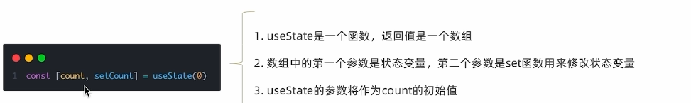

## 相关文档
[react](https://react.docschina.org/)

[babel](https://www.babeljs.cn/)
## jsx
### 优点
1. html 声明式模版写法
2. js的编程能力
### jsx本质
jsx 是js语法的扩展，浏览器本身不能识别，需要通过解析工具做解析[babel](https://www.babeljs.cn/) 解析之后才能在浏览器中运行
### jsx使用

## 创建命令
### cli
```bash
npx create-react-app my-app
```
### vite
```bash
pnpm create vite
```
## 渲染流程
App.js ——> main.js——> index.html(root)
## api
### useState 状态变量
> useState 状态变量
> 状态只是可读的,应该使用setCount替换它而不是修改它,直接修改不能引发视图更新
### useRef
> useRef 获取当前元素绑定的dom对象 .current 属性
## 样式
**class 得写成 className**
```html
<span className='foo'>this is span </span>
```


## 相关工具库

[lodash](https://www.lodashjs.com/)

[classnames](https://github.com/JedWatson/classnames)

[uuid](https://github.com/uuidjs/uuid)

[dayjs](https://dayjs.fenxianglu.cn/)

