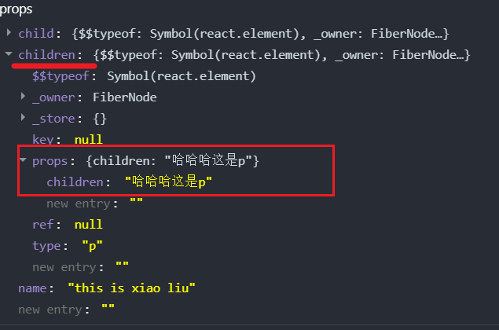

## 相关文档
[react](https://react.docschina.org/)

[babel](https://www.babeljs.cn/)
## jsx
### 优点
1. html 声明式模版写法
2. js的编程能力
### jsx本质
jsx 是js语法的扩展，浏览器本身不能识别，需要通过解析工具做解析[babel](https://www.babeljs.cn/) 解析之后才能在浏览器中运行
### jsx使用

## 创建命令
### cli
```bash
npx create-react-app my-app
```
### vite
```bash
pnpm create vite
```
## 渲染流程
App.js ——> main.js——> index.html(root)
## api
### useState 状态变量
> useState 状态变量
> 状态只是可读的,应该使用setCount替换它而不是修改它,直接修改不能引发视图更新
### useRef
> useRef 获取当前元素绑定的dom对象 .current 属性
## 组件间的通信
### prop
```jsx
// 父 -> App
const App = () => {
    const name = 'this is xiao liu'
    return (
        <div>
            <Communication name={name} child={<span>this is span</span>}>
                <p>哈哈哈这是p</p>
            </Communication>
        </div>
    )
}
```
```jsx
// 子 -> Communication
const Communication = (props) => {
    return (
        <div>
            {props.name}
            <br/>
            jsx:{props.child}

            {props.children}
        </div>
    );
};
```

> 如果把内容嵌套在了子组件的标签中，父组件会自动在名为children的prop属性中接收该内容

> 

### 子传父
```jsx
// 子 -> Communication02
const Communication02 = ({ onGetCommunication}) => {
    const msg = 'this is communication msg'
    return (
        <div>
            <button onClick={() => onGetCommunication(msg)}>点击</button>
        </div>
    );
};
```
```jsx
// 父 -> App
const App = () => {
    const getMsg = (msg) => {
        console.log('app-msg', msg)
        setContent(msg)
    }
    const [content,setContent] = useState('')
    return (
        <div>
            {content}
            <Communication02 onGetCommunication={getMsg}/>
        </div>
    )
}
```
> 在子组件中调用父组件中的函数并传递参数


## 样式
**class 得写成 className**
```html
<span className='foo'>this is span </span>
```


## 相关工具库

[lodash](https://www.lodashjs.com/)

[classnames](https://github.com/JedWatson/classnames)

[uuid](https://github.com/uuidjs/uuid)

[dayjs](https://dayjs.fenxianglu.cn/)

